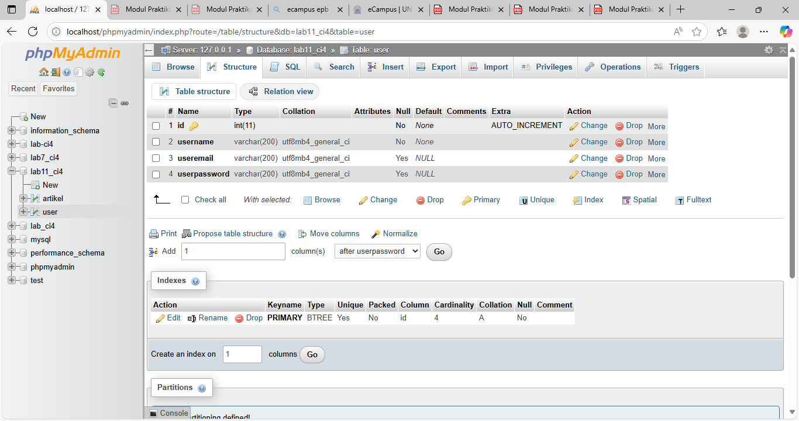
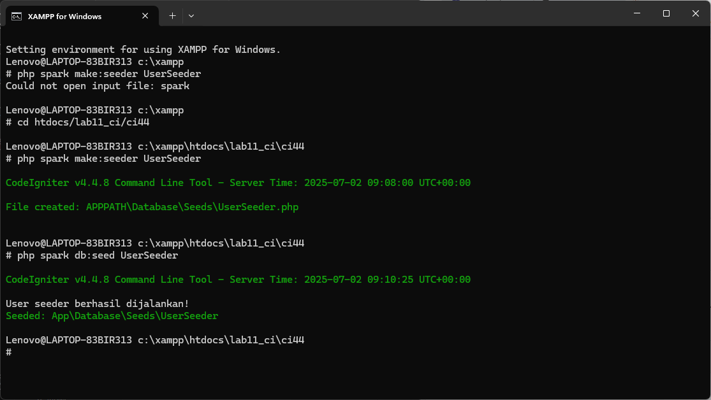
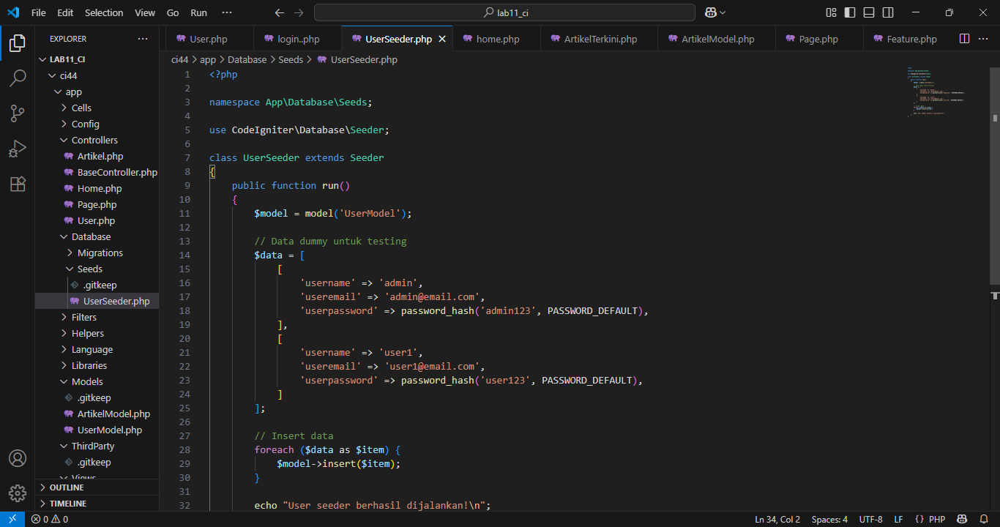
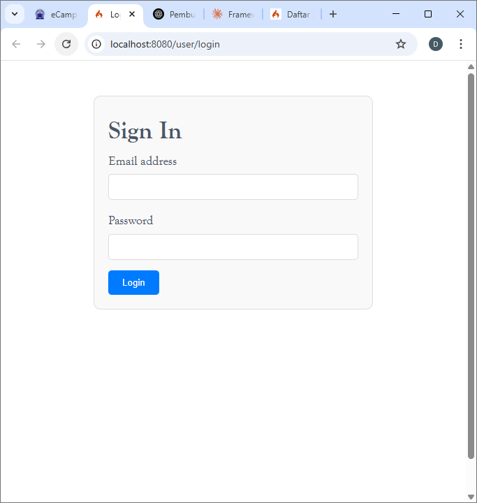
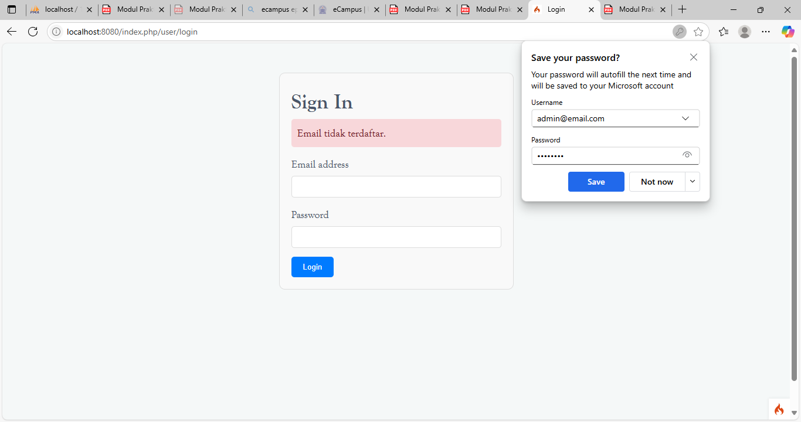
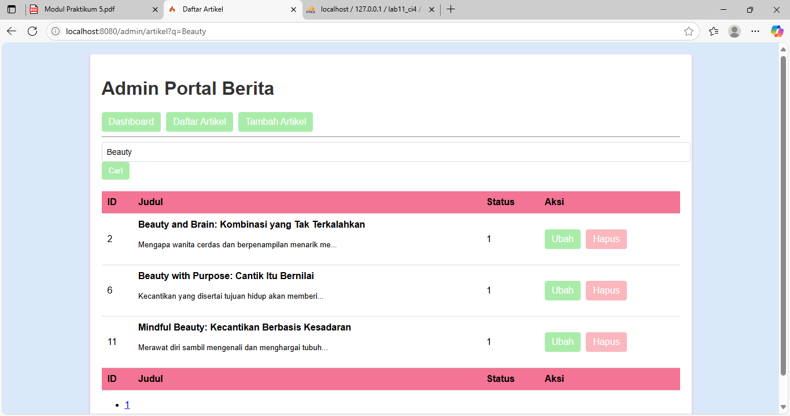
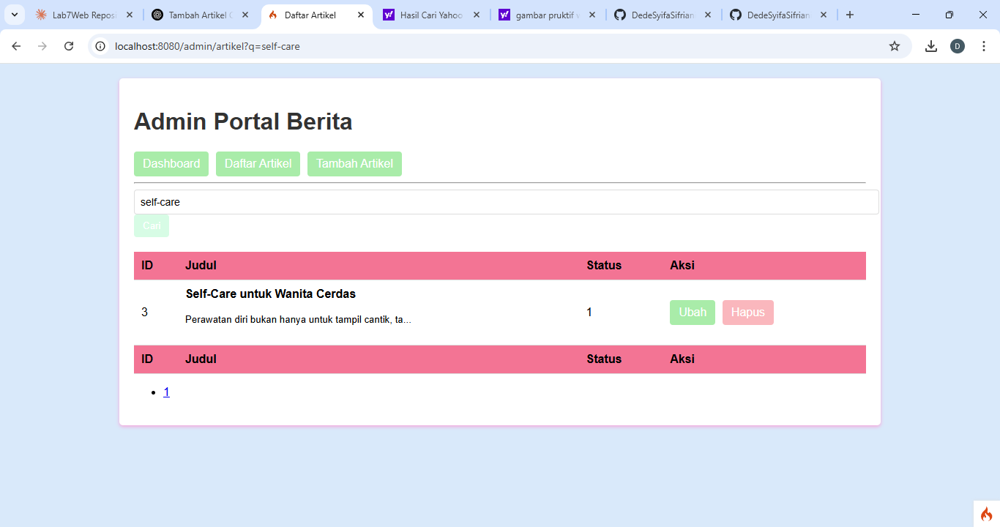
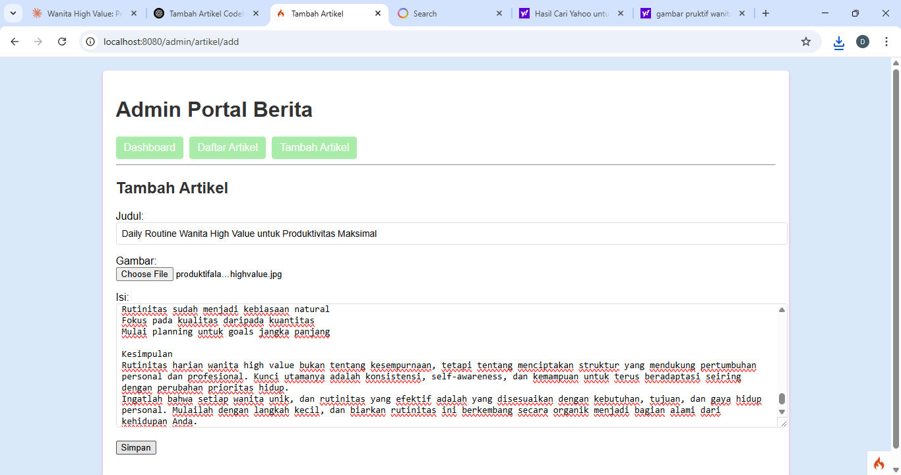
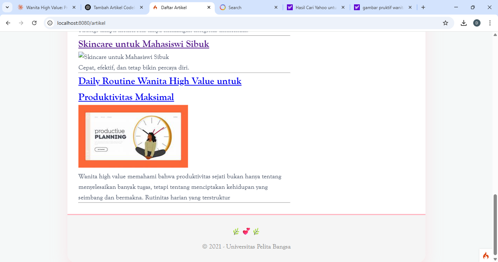

# Praktikum Pemrograman Web 2 – CodeIgniter 4

Repository ini berisi hasil pengerjaan **Praktikum 4,FIVE,6** pada mata kuliah *Pemrograman Web 2* menggunakan framework **CodeIgniter 4**.

## Informasi Praktikum
- **Nama**: [Dede Syifa Sifriani]
- **NIM**: [312310372]
- **Kelas**: [TI.23.C2]


---

## 📚 Modul 4 – Modul Login dan Auth

### ✅ Fitur:
- Sistem login menggunakan email dan password
- Hash password menggunakan `password_hash()`
- Filter Auth untuk membatasi akses ke halaman admin
- Session login & logout

### 🔐 Akun Sample:
- **Email:** admin@email.com  
- **Password:** admin123

## 🔐 Login & Auth (Modul 4)

Fitur login menggunakan email dan password terenkripsi. Filter `Auth` digunakan untuk melindungi halaman admin agar hanya dapat diakses oleh user yang sudah login.

**Struktur:**
- `app/Controllers/User.php`
- `app/Models/UserModel.php`
- `app/Views/user/login.php`
- `app/Filters/Auth.php`

**Contoh kode login:**
```php
if (password_verify($password, $user['userpassword'])) {
    session()->set([
        'user_id' => $user['id'],
        'user_name' => $user['username'],
        'logged_in' => TRUE
    ]);
    return redirect('admin/artikel');
}
```

**Filter Auth:**
```php
if (!session()->get('logged_in')) {
    return redirect()->to('/user/login');
}
```


### 📷 Screenshot:
**Bukti pengerjaan**
 [](latihan4/bukti1.png)
 [](latihan4/bukti2.png)
 [](latihan4/bukti3.png)

**Tampilkan halaman login**

 [](latihan4/Hasilakhir.png)

**Akun dibatasi**
 [](latihan4/akundibatasi.png)

## 📚 Modul 5 – Pagination dan Pencarian

### ✅ Fitur:
- **Pagination otomatis** pada daftar artikel
- **Pencarian artikel** berdasarkan judul menggunakan `like`

### 🧠 Cuplikan Kode:
```php
// Controller
$q = $this->request->getVar('q') ?? '';
$artikel = $model->like('judul', $q)->paginate(10);
// View
<form method="get">
    <input type="text" name="q" value="<?= $q; ?>" placeholder="Cari artikel">
    <button type="submit">Cari</button>
</form>

<?= $pager->only(['q'])->links(); ?>
```


**📷 Screenshot :**
**Tampilan pagination**
 
 
**Hasil pencarian**
 [](latihan5/filterdata.png)

# 📁 Modul 6 – Upload File Gambar (CodeIgniter 4)

Modul ini merupakan bagian dari praktikum Pemrograman Web 2 yang berfokus pada fitur **upload gambar** untuk artikel di portal berita berbasis CodeIgniter 4.

---

## ✨ Fitur Utama

- **Form tambah artikel** dengan upload gambar
- **Validasi**: judul wajib diisi
- **Penyimpanan gambar** di folder `public/gambar/`
- **Database**: nama file gambar disimpan di database dan ditampilkan di halaman artikel

---

## 🧱 Struktur Terkait

| Komponen | Lokasi |
|----------|--------|
| Controller | `app/Controllers/Artikel.php` |
| Model | `app/Models/ArtikelModel.php` |
| View | `app/Views/artikel/form_add.php` |
| Folder Upload | `public/gambar/` |

---

## 🔄 Proses Upload File

### 📥 Controller (`Artikel.php`)

```php
$file = $this->request->getFile('gambar');
$file->move(ROOTPATH . 'public/gambar');
$artikel->insert([
    'judul'  => $this->request->getPost('judul'),
    'isi'    => $this->request->getPost('isi'),
    'slug'   => url_title($this->request->getPost('judul')),
    'gambar' => $file->getName(),
    'status' => 1
]);
```

### 📋 Penjelasan Kode

1. **Mengambil file gambar** dari request menggunakan `getFile('gambar')`
2. **Memindahkan file** ke folder `public/gambar/` dengan `move()`
3. **Menyimpan data artikel** ke database termasuk nama file gambar
4. **Membuat slug** otomatis dari judul artikel menggunakan `url_title()`

### 🎯 Validasi dan Keamanan

- **Validasi judul**: wajib diisi sebelum artikel dapat disimpan
- **Folder upload**: terpisah dari aplikasi untuk keamanan
- **Status artikel**: otomatis diset ke 1 (aktif)

### 💡 Tips Implementasi

- Pastikan folder `public/gambar/` memiliki permission write
- Tambahkan validasi untuk tipe file gambar yang diizinkan
- Pertimbangkan untuk menggunakan nama file unik untuk menghindari konflik
- Implementasikan validasi ukuran file maksimal

  **📷 Screenshot :**
**Tambah gambar**
 

**Hasil tambah gambar**
 [](latihan6/berhasiltambahgambar.png)


 
## 👨‍🏫 Dosen Pengampu

**Agung Nugroho**  
Universitas Pelita Bangsa  
Mata Kuliah: Pemrograman Web 2
